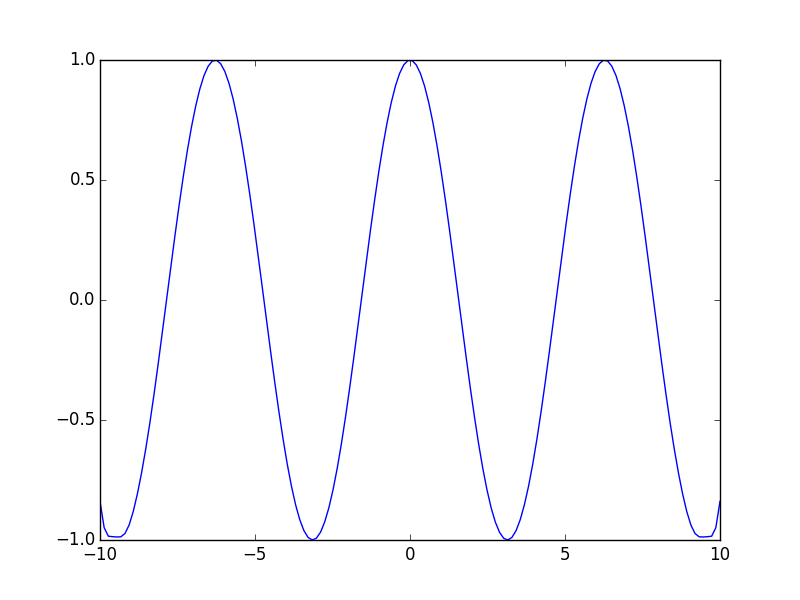
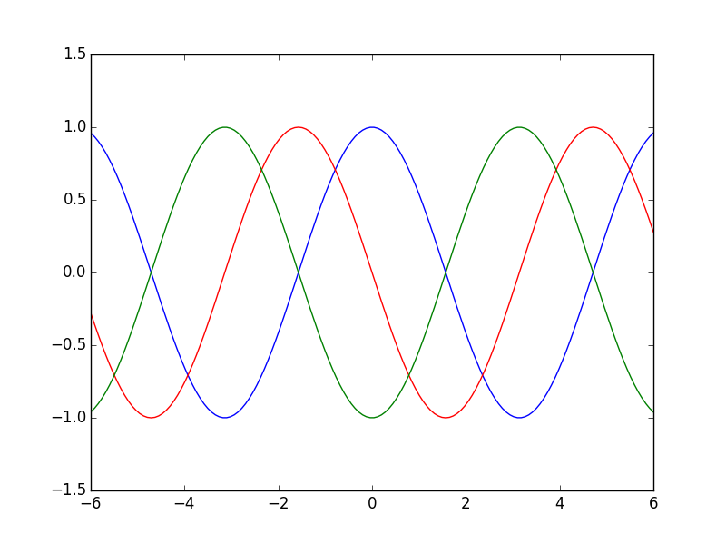
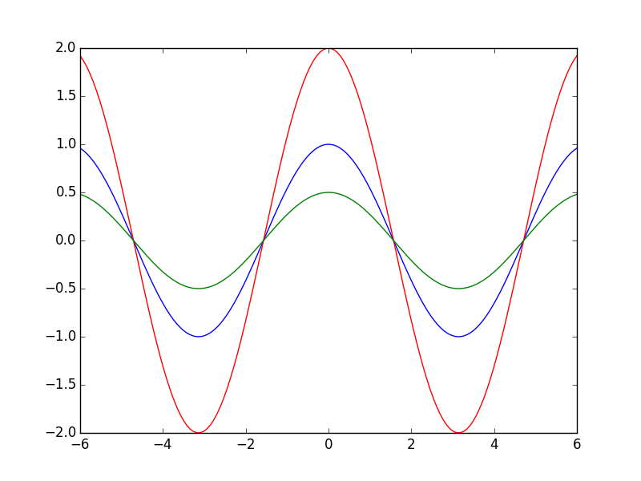
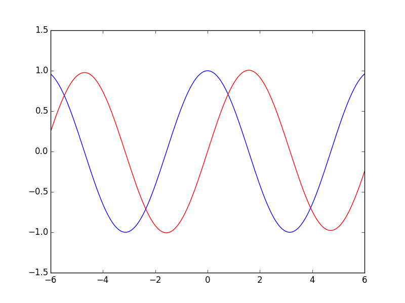

# Splines.jl
A B-Spline interpolation package for Julia

## Getting Started
You can install the Splines module in Julia
~~~julia
Pkg.checkout("git@github.com:bnels/Splines.jl.git")
Pkg.build("Splines")
~~~
You can update the package using the usual
~~~julia
Pkg.update()
~~~
Now you're ready to start using Splines!

## Basics
Splines.jl uses B-Splines as a basis for constructing Spline interpolations.  This is all under the hood, so for basic spline manipulations, you only need to provide a knot sequence, function values at knots, and what order of spline you would like to use (e.g. 4th order splines are piecewise cubic).
~~~julia
using Splines

ts = [linspace(-10,10,50);] # knot sequence
vs = cos(ts) # signal values at knots
m = 4 # cubic splines

S = Spline(vs, ts, m)
~~~
You can now treat your spline as a function, and can evaluate it at any point, or a vector of points
~~~julia
using PyPlot

xs = [linspace(-10,10,150);]
ys = S(xs)
plot(xs, ys)
~~~

## Beyond the Basics

### Derivatives
You can take derivatives of your spline interpolation by adding an extra argument to your Spline function call
~~~julia
using Splines
using PyPlot

ts = [linspace(-10.,10.,50);] # knot sequence
vs = cos(ts) # values at knots
m = 6 # spline order

S = Spline(vs, ts, m)

xs = [linspace(-6,6,150);] # points to evaluate splines at

plot(xs, S(xs), "blue")
plot(xs, S(xs, 1), "red")
plot(xs, S(xs, 2), "green")
~~~

Note that the number of derivatives you can take is limited by the order of spline you are using, and that you will begin to lose accuracy at the endpoints of your knot sequence as you increase derivatives

### Arithmetic Operations
Splines support muliplication and division by scalars.
~~~julia
# still using the Spline on cosine input
plot(xs, S(xs), "blue")
plot(xs, 2*S(xs), "red")
plot(xs, S(xs)/2, "green")
~~~

You can also add two splines together.  The resulting spline will be on the union of their knot sequences.
~~~julia
S = S1 + S2
~~~

### Hilbert Transforms
You can also take the Hilbert transform of splines.  This is useful for the EMD algorithm (e.g. [EMD.jl](https://github.com/bnels/EMD.jl)) and signal processing.  You can tell a Spline to return its Hilbert transform by setting its third argument to a boolean true.
~~~julia
plot(xs, S(xs), "blue") # cos(x)
plot(xs, S(xs, 0, true), "red") # should be sin(x)
~~~

You can also take derivatives of the Hilbert transform by setting the second argument to an integer other than 0.

